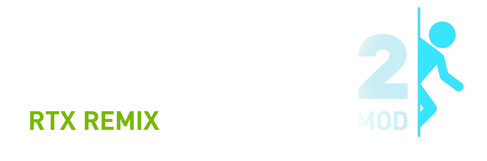
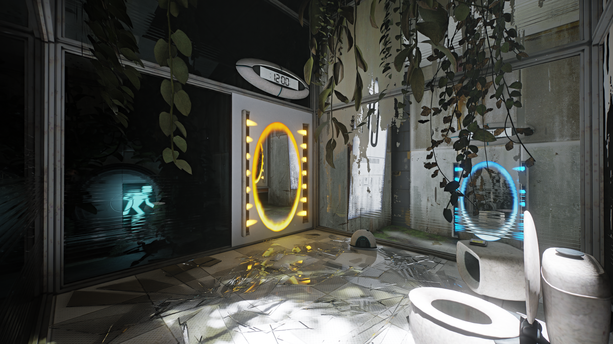
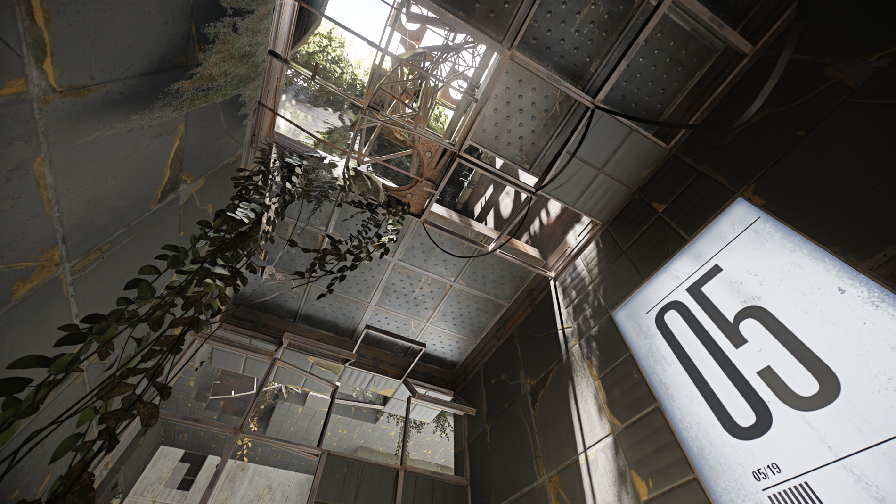
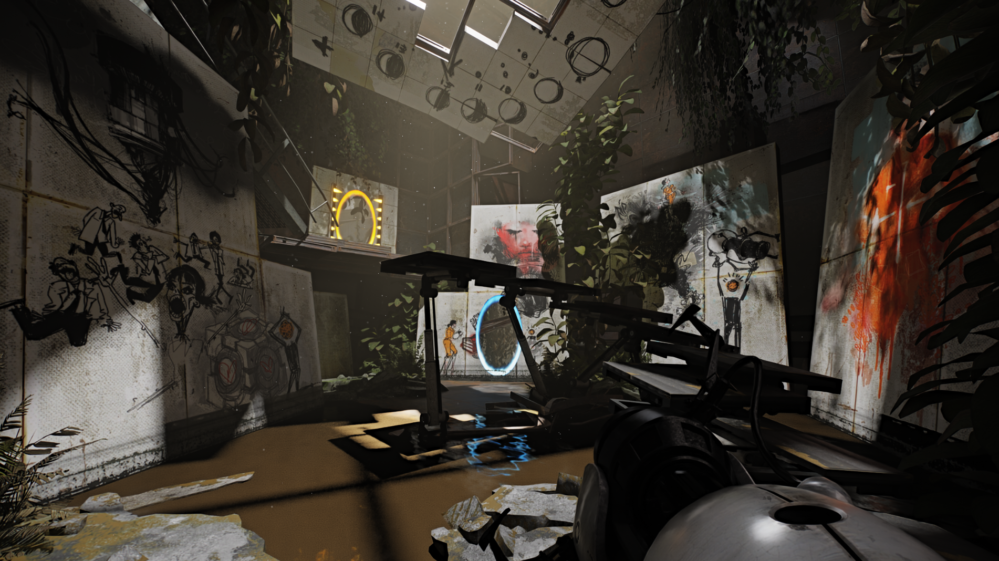
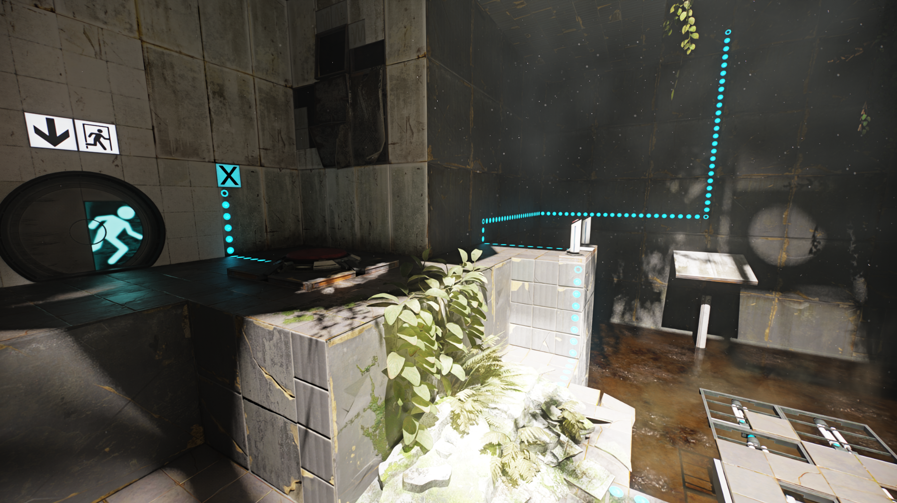
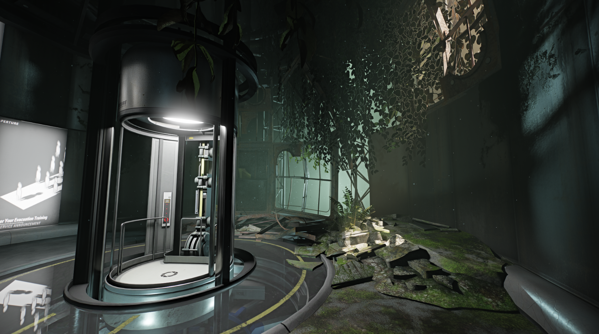

<h1 align="center">Portal 2 RTX Remix Compatibility Mod</h1>

 

This client modification is specifically made for nvidia's [rtx-remix](https://github.com/NVIDIAGameWorks/rtx-remix).  
How does a shader based game work with remix? By manually reimplementing fixed function rendering :) 

 

__WIP__ & __Please Note:__  
RTX Remix was never intented to support Portal 2.  
If you encounter crashes, broken things or similar, it's either due to incompatibility, the limits of fixed function rendering (not being able to get the same result that shaders can achieve)  
or due to bugs in the compatibility mod itself.  

 

### This is not trying to be a remaster.
It simply makes the game compatible with RTX Remix.

Please keep that in mind.

### __[ Remix Compatibility Features ]__   
🔹Most things are rendered using the fixed-function pipeline🔹  
🔹Remix friendly culling and the ability to manually override culling🔹  
🔹Ability to spawn and animate lights on events using a keyframe system🔹  
🔹Per map loading of remix config files to set remix variables🔹  
🔹Ability to animate remix variables on events🔹  
🔹Spawning of unique anchor meshes🔹  
🔹Per map fog settings🔹  

 
 

If you want to support my work,  
consider buying me some coffee:  

 
 

 

## Installation / Usage
- Download the latest [release](https://github.com/xoxor4d/p2-rtx/releases) and follow instructions found __there__.

 

#### ✳️ Info: 
- Take a look at the [Wiki](https://github.com/xoxor4d/p2-rtx/wiki/Compatibility-Mod-Feature-Guide) for in-depth guides on features that come with the compatibility mod 🍓
  
- Current releases ship with:
  - [custom build of the remix-dxvk runtime](https://github.com/xoxor4d/dxvk-remix/tree/game/p2) which includes necessary changes  
for Portal 2 (`bin/.trex/d3d9.dll`)
  - [custom build of bridge-remix](https://github.com/xoxor4d/bridge-remix/tree/pr/remixapi-add-remove-texhash) which includes necessary changes  
for Portal 2 (`bin/.trex/NvRemixBridge.exe` & `bin/d3d9.dll`)

- Some engine tweaks that are required to make the game compatible result in CPU bottlenecks on some maps (software skinning instead of HW skinning). This may or may not improve in future updates.

 

#### ⚠️ Troubleshooting (click to expand):

Do I need to start the game from the batch file every time?

 

1. No, copy all of the commandline arguments of the batch file (everything after `START portal2.exe`)
   
2. Add them as launch args by right clicking Portal 2 in Steam -> Properties -> Launch Options

3. Sart the game from Steam

 

How do I disable remix?

 

- Run `toggle-p2-rtx.bat` and follow the instructions to disable or enable the mod

 

Crashing or similar issues

 

- Make sure that you have no clipping software such as "medal" running in the background
- Run the launcher with admin rights (only required if your game is installed within `Program Files`)
- Make sure that the title of the portal 2 window changes to `Portal 2 - RTX ...`
- Download and install [DirectX End-User Runtimes (June 2010)](https://www.microsoft.com/en-ie/download/details.aspx?id=8109)

 

Portals not showing up or looking incorrect

 

- Make sure that you installed the [base-remix-mod](https://github.com/xoxor4d/p2-rtx-base-mod) as stated in the release notes

 

No sound

 

- Either copy `_master.cache` from `root/portal2/maps/soundcache` to `root/portal2_dlc3/maps/soundcache` 
- Or paste this into the in-game console and execute: `snd_rebuildaudiocache;snd_updateaudiocache;exit`

 

Game is too dark, sunlight is leaking on certain maps, textures look flat

 

- This is not an issue with the compatibility mod itself. It's up to the people modding the game using the remix toolset to place proper lights and overhaul textures and meshes.

 

- Other Issue?
> - Look at [Closed Issues](https://github.com/xoxor4d/p2-rtx/issues?q=is%3Aissue+is%3Aclosed) or [Discussions](https://github.com/xoxor4d/p2-rtx/discussions) to see if people had similar issues

 

##  Credits
- [Nvidia - RTX Remix](https://github.com/NVIDIAGameWorks/rtx-remix)
- [People of the showcase discord](https://discord.gg/j6sh7JD3v9) - especially the nvidia engineers ✌️
- All early access people for testing/bug reporting and for covering my electricity bill ⚡
- [Wolƒe Strider Shoσter](https://github.com/wolfestridershooter) - for all the high quality bug reports! 
- Yosuke Nathan - Portal 2 Remix Logo
- [dear-imgui](https://github.com/ocornut/imgui)
- [imgui-blur-effect](https://github.com/3r4y/imgui-blur-effect)
- [minhook](https://github.com/TsudaKageyu/minhook)
- [toml11](https://github.com/ToruNiina/toml11)
- [dxwrapper](https://github.com/elishacloud/dxwrapper)

 

